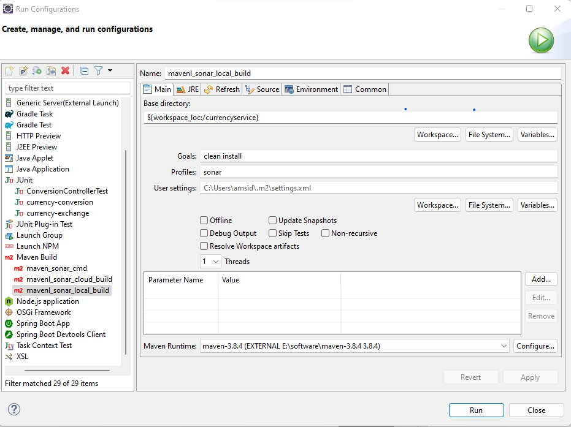
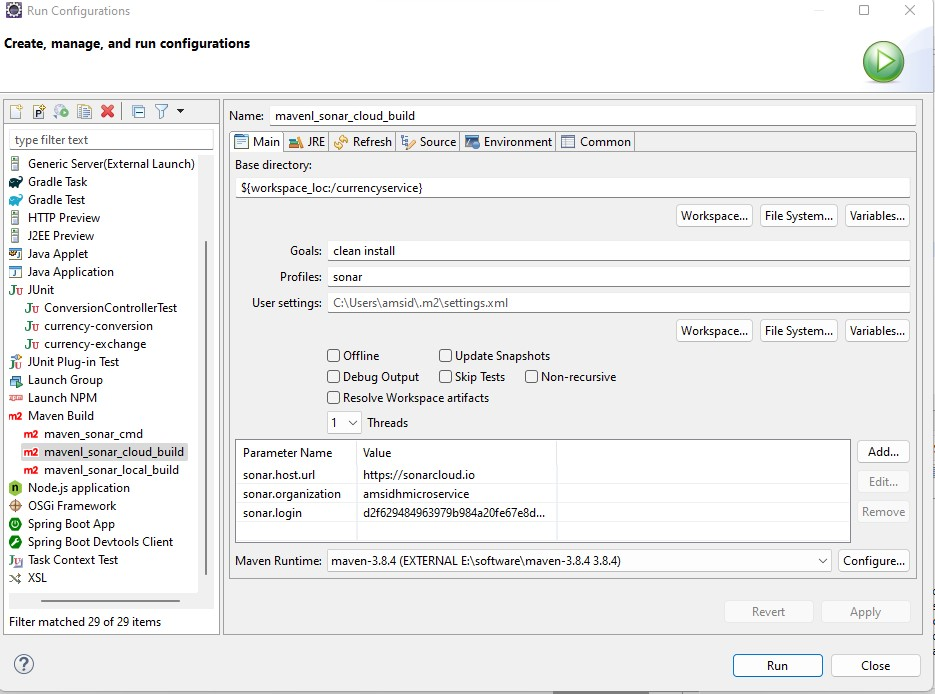

For SonarQube Missing blame information, add properties <sonar.scm.disabled>true</sonar.scm.disabled> in maven plugin
configuration

For running the sonar profile, pass the sonar.login parameter.

### Local SonarQube:
# To run this project on local sonarqube server. Kindly add following properties in 
   parameter name and values in maven configuration like following
   

### Cloud SonarQube:
# To run this project on sonar cloud, run the following maven configuration 

### Sonar profile configuration:
'''
 
 <profile>
    
    <id>sonar</id>
    
    <activation>
      <activeByDefault>false</activeByDefault>
    </activation>

    <properties>
      <!-- Sonar Properties-->
      <sourceDirectory>${basedir}/src/main</sourceDirectory>
      <testSourceDirectory>${basedir}/src/test</testSourceDirectory>
      <sonar.host.url>http://localhost:9000</sonar.host.url>
      <sonar.login>admin</sonar.login>
      <sonar.password>admin123</sonar.password>
      <sonar.scm.disabled>true</sonar.scm.disabled>
      <sonar.scm.provider>git</sonar.scm.provider>
      <sonar.log.level>TRACE</sonar.log.level>
      <sonar.verbose>true</sonar.verbose>
      <sonar.sourceEncoding>UTF-8</sonar.sourceEncoding>
      <sonar.tsql.file.suffixes>sql,tsql</sonar.tsql.file.suffixes>
      <sonar.plsql.file.suffixes>pks,pkb</sonar.plsql.file.suffixes>
    </properties>
      <build>
          <plugins>
              <plugin>
                  <groupId>org.sonarsource.scanner.maven</groupId>
                  <artifactId>sonar-maven-plugin</artifactId>
                  <version>3.9.1.2184</version>
                  <executions>
                      <execution>
                          <id>sonar-cloud</id>
                          <phase>install</phase>
                          <goals>
                              <goal>sonar</goal>
                          </goals>
                      </execution>
                  </executions>
              </plugin>
              <plugin>
                  <groupId>org.apache.maven.plugins</groupId>
                  <artifactId>maven-surefire-plugin</artifactId>
                  <version>3.0.0-M7</version>
              </plugin>
              <plugin>
                  <groupId>org.apache.maven.plugins</groupId>
                  <artifactId>maven-failsafe-plugin</artifactId>
                  <version>3.0.0-M7</version>
                  <executions>
                      <execution>
                          <id>integration-test</id>
                          <goals>
                              <goal>integration-test</goal>
                          </goals>
                      </execution>
                  </executions>
              </plugin>
              <plugin>
                  <groupId>org.jacoco</groupId>
                  <artifactId>jacoco-maven-plugin</artifactId>
                  <version>0.8.8</version>
                  <executions>
                      <execution>
                          <id>prepare-and-report</id>
                          <goals>
                              <goal>prepare-agent</goal>
                              <goal>report</goal>
                          </goals>
                      </execution>
                      <execution>
                          <id>report-aggregate</id>
                          <phase>verify</phase>
                          <goals>
                              <goal>report-aggregate</goal>
                          </goals>
                      </execution>
                  </executions>
              </plugin>
          </plugins>
      </build>
 
 </profile>

'''